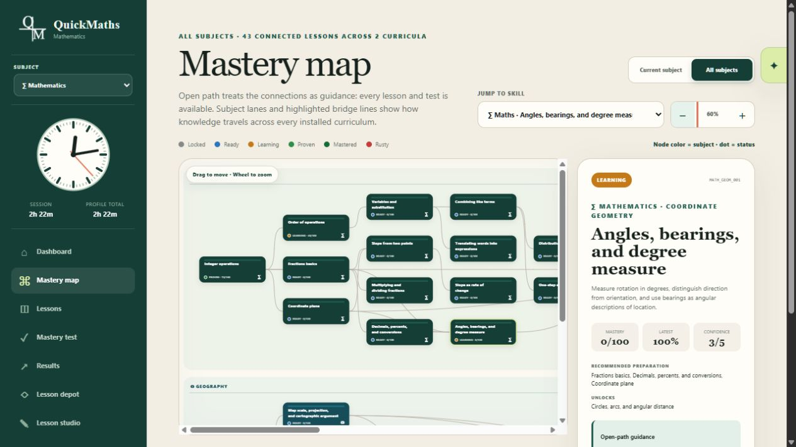

# QuickMaths

[](https://github.com/QuickMathematics/QuickMaths/actions/workflows/ci.yml)
[](https://quickmathematics.github.io/QuickMaths/)

QuickMaths is a browser-first, local-first mastery learning app with prerequisite maps, substantial Mathematics and Geography curricula, structured proof/review workflows, lesson authoring, and an optional WebMCP tutor surface.

[](https://quickmathematics.github.io/QuickMaths/#/map)

The public app runs entirely from GitHub Pages:

**https://quickmathematics.github.io/QuickMaths/**

No QuickMaths account, model API key, or paid application server is required. Learner state autosaves in the browser and can be moved with full JSON backups or the optional GitHub Bridge.

QuickMaths predates the challenge; the [WebMCP challenge document](WEBMCP_CHALLENGE.md#challenge-period-delta) separates the original application from the challenge-period extension and links the dated commit evidence.

## What is in the app

- Multiple learner profiles with separate progress, attempts, reviews, timers, and preferences
- Mathematics and Geography mastery maps, including cross-subject prerequisite bridges
- Enforced Hard path and guideline-only Open path
- Lesson-defined comprehensive mastery tests with generated variants, required work, proofs, and review gates
- Human Lesson Studio for new subjects, new lessons, and reversible native-lesson improvements
- Public Lesson Depot with optional GitHub Discussion upvotes and comments
- Seventeen WebMCP tools for visible navigation, tutoring, curriculum inspection, and human-controlled lesson staging
- Optional GitHub Bridge for revision-safe mobile/remote-agent checkpoints

## Run the web app locally

```powershell
python -m http.server 8765 --directory docs
```

Open `http://localhost:8765/`.

The learner app is `docs/index.html`; the dedicated WebMCP agent workspace is `docs/agent-bridge.html`; the mobile/storage walkthrough is `docs/bridge-guide.html`.

## Local Git Bridge for Codex

The small Python package is not a second learner app. It remains solely for curriculum validation/export and the loopback Git Bridge.

```powershell
python -m venv .venv
.\.venv\Scripts\Activate.ps1
python -m pip install -e ".[dev]"
python -m quickmaths.cli agent-bridge --repo https://github.com/YOUR-NAME/quickmaths-sync.git
```

Open the printed `127.0.0.1` URL in a WebMCP-compatible agent browser. The loopback server uses the computer's existing Git credentials and exposes only `learner-state.json` and `agent-state.json` from the selected data repository.

## Curriculum development

The native Mathematics curriculum is authored in YAML under `content/math/algebra_foundations/`. Geography and its Mathematics bridge live in `content/geography/foundations/web-curriculum.json`.

Validate native YAML:

```powershell
python -m quickmaths.cli validate-content --strict-warnings
```

Regenerate the browser curriculum after native YAML changes:

```powershell
python scripts/export_web_curriculum.py
```

For portable custom lessons and native improvements, use the in-app Lesson Studio or the [Agent Lesson Authoring Guide](docs/CUSTOM_LESSON_SETS.md).

## Test

```powershell
python -m pytest -q
node --test docs/*.test.js
node --test community-worker/src/*.test.js
```

## Repository map

- `docs/` — the complete GitHub Pages app, WebMCP tools, guides, and browser tests
- `content/` — first-party curriculum sources
- `quickmaths/` — focused curriculum tooling and local Git Bridge
- `scripts/` — curriculum and Lesson Depot build/validation scripts
- `community-worker/` — stateless GitHub Community OAuth callback worker
- `tests/` — Python curriculum, grading, Depot, and Bridge tests
- `WEBMCP_CHALLENGE.md` — challenge architecture and demo walkthrough

## Storage and authorization boundaries

Browser autosave, GitHub learner storage, and Lesson Depot community authorization are three separate systems. Storage tokens are entered only in the app, are never committed, and should be restricted to a dedicated data repository. Community authorization cannot read learner state; its public actions are limited to GitHub Discussion reactions and comments.

QuickMaths is MIT licensed.
