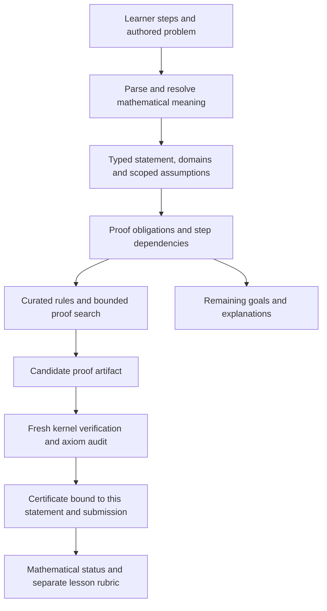

# A general proof assistant for QuickMaths

**Status:** Future implementation proposal; no prover is implemented by this document.

**Date:** 9 September 2026.

**Baseline:** QuickMaths commit `47b97d2`; structured limit work currently requires tutor review.

## 1. The target and its limits

Build an educational proof assistant in which a learner can state a mathematical claim, construct an argument, see the remaining obligations, and receive a reproducible certificate when the entire argument is verified. It should eventually cover ordinary school and university mathematics without requiring learners to write a proof-assistant programming language.

There are three different meanings of “complete”:

| Meaning | Our commitment |
| --- | --- |
| Every accepted proof is complete: no missing steps, unsupported hypotheses or unproved obligations | Required, relative to a documented foundation and interpretation |
| The language can express broad mathematics and users can supply sophisticated proofs | Long-term goal using an established proof assistant |
| Automation always terminates and correctly proves or disproves every mathematical statement | Impossible in general |

Undecidability rules out the universal terminating solver. Incompleteness also limits what an effectively axiomatized, consistent theory strong enough for arithmetic can establish. First-order logic's completeness theorem does not make arbitrary mathematical theories decidable. A timeout or an unsuccessful search must therefore remain “not established,” never “false.” [Stanford lecture on first-order theories, decidability and incompleteness](https://theory.stanford.edu/~arbrad/slides/cs156-old/lec3-4.pdf).

“Future proof” means stable mathematical contracts, replaceable automation, reproducible old results, and a controlled way to extend the supported theories. It cannot mean zero maintenance or unlimited automatic reasoning.

**Recommended product:** QuickMaths owns the educational experience and formalization layer; Lean 4 and mathlib supply the initial formal foundation. Start with a narrow, trustworthy algebra/calculus assistant, while choosing representations that also accommodate quantifiers, induction, sets and functions.

## 2. Build on a kernel; do not start by inventing one

Lean tactics construct proof terms that the kernel checks. This separates potentially complicated proof search from the smaller mechanism that establishes whether the resulting proof has the required type. [Lean tactic proofs](https://lean-lang.org/doc/reference/latest/Tactic-Proofs/).

The initial feasibility study should compare two real candidates:

| Candidate | Why investigate it | Decision criterion |
| --- | --- | --- |
| Lean 4 + mathlib | Proposed default; reuse formal mathematics and expose curated proof operations through an adapter | Can we faithfully express our domains, reconstruct student steps, and deliver useful feedback at acceptable cost? |
| Isabelle/HOL | Alternative if its proof automation and library fit our chosen exercises better | Run the same representative claims; compare integration effort and proof reconstruction |
| A new custom kernel | Control over everything, but also responsibility for logic, implementation correctness, libraries and tooling | Reject for this product unless building a new proof foundation becomes the project's primary purpose |

Isabelle's Sledgehammer provides a useful architectural precedent: outside provers search for results, then proofs are reconstructed within Isabelle. A solver's answer alone is not the certificate. [Official Sledgehammer guide](https://isabelle.in.tum.de/doc/sledgehammer.pdf).

Select one backend after the spike. Do not fund multiple production backends prematurely. Keep a narrow adapter boundary, while preserving backend-specific proof artifacts; mathematical proofs are not automatically portable between foundations.

## 3. Architecture and trust boundaries

The proof kernel is necessary but insufficient for product correctness. A perfectly checked proof of the wrong translation is still the wrong answer to the lesson. There are three assurance boundaries:

1. **Meaning:** the displayed question, parsed statement and domain really match.
2. **Mathematics:** the proof establishes that exact statement under the stated assumptions.
3. **Education:** the submitted work meets the lesson's method and explanation requirements.

The first version needs independently reviewed translation fixtures, a canonical statement preview, and explicit mappings from learner steps to verified obligations. Later, prove correctness of particularly critical translation passes where practical.

### Components to implement

| Component | Responsibility | Must not do |
| --- | --- | --- |
| Mathematical editor | Accessible expressions, statements, justifications and nested subproofs | Silently reinterpret ambiguous text |
| Typed mathematical representation | Exact values, types, binders, domains and source locations | Treat a rendered string as authoritative semantics |
| Obligation manager | Track claims, dependencies, local assumptions and remaining goals | Reuse a temporary assumption outside its scope |
| Rule registry | Map named educational rules to checked formal lemmas | Accept a package's claim that its rule is sound |
| Backend adapter | Translate the typed representation into the selected foundation | Inject arbitrary package code |
| Search worker | Try deterministic tactics, then optional candidate generators | Assign verified status itself |
| Verifier | Check proof, exact target, environment and permitted dependencies | Trust a success flag from a worker |
| Feedback mapper | Explain a failed obligation in learner language | Turn a timeout into an incorrect-answer verdict |
| Evidence store | Preserve submissions, certificates and compatible environments | Reattach an old certificate to edited content |

## 4. Mathematical representation

Use a versioned typed tree, not increasingly elaborate regular expressions. The initial expression language should remain small, but its statement model must support extension.

- Exact integers and rationals; decimals acquire an explicit exact or approximate interpretation.
- Types such as natural numbers, integers, rationals, reals, sets and functions. Complex numbers and matrices arrive as explicit extensions.
- Variables with stable IDs and scoped binders, not names alone.
- Expressions, equality, inequality, implication, equivalence, conjunction, disjunction, negation and quantifiers.
- Definitions distinguished from hypotheses, established facts and goals.
- Domains and definedness obligations attached to expressions and transformations.
- Source spans linking formal obligations to the original learner input.
- Canonical serialization with a version, deterministic content hashes and explicit migrations.

Do not let an unknown identifier silently become a new variable or function. Distinguish equality from approximation, multiplication from function application, and real from integer division. Ask for clarification when a parse has materially different meanings.

The rendered canonical statement should be available before checking: “For every real x other than 3…” is easier to inspect than a hidden AST. Natural-language input can propose this representation; the confirmed representation is what gets proved.

### Domains are first-class

School expressions are often partial functions. Formal libraries can define operations outside their familiar school domains. Our adapter must introduce the intended guards, rather than assume library evaluation automatically models classroom meaning. For example, mathlib explicitly documents a total real square-root function with a convention on negative inputs. [Mathlib square-root definitions](https://leanprover-community.github.io/mathlib4_docs/Mathlib/Analysis/Real/Sqrt.html).

The following distinctions must survive simplification:

- `(x²-9)/(x-3)` requires `x != 3`, even after cancellation.
- `sqrt(x²) = abs(x)`; replacing it by `x` needs a nonnegative assumption.
- Squaring an equation may introduce candidates; it is not automatically an equivalence.
- Dividing an inequality requires a nonzero divisor and knowledge of its sign.
- Adding a domain restriction can weaken a claim. It is not automatically a valid proof of the original goal.
- Equality everywhere, equality on a specified set, and equality sufficiently near a point are different claims.

Track the original expression's domain separately from the simplified expression's own domain. A transformation carries the relationship between them as evidence.

## 5. Proof state and step checking

Represent an argument as a dependency graph with nested scopes. Each node records:

1. The claim and local context.
2. The cited premises or previously established nodes.
3. The proposed rule and its instantiated parameters.
4. Generated side conditions and unresolved subgoals.
5. The resulting evidence, if established.

A rule such as cancellation generates a nonzero obligation. A proof by cases generates an exhaustiveness obligation. An induction creates a base case and a properly scoped induction hypothesis. Introducing an existential statement needs a witness; using one requires correct elimination scope.

Reject circular dependencies, references to later unproved facts, and use of the final goal as an assumption. Final verification composes the whole argument, not merely independent local comparisons.

Automatic gap filling must be visible. There are two different modes:

- **Proof assistance:** the app may offer and insert an explicitly marked missing argument.
- **Assessment:** the rubric determines which routine steps can be implicit; substantive missing work remains missing even if the solver knows the answer.

A backend proof of the answer does not establish that the learner's submitted derivation is valid. Store that distinction in the evidence.

## 6. Calculus semantics and first worked example

Build the calculus adapter around neighborhoods and directed approach semantics, rather than repeated numeric substitution. Represent the variable, approach point, direction, domain, original expression and result kind separately.

Supported result kinds should include finite real value, positive infinity, negative infinity, and no common two-sided limit. Nonexistence needs a proof, for example incompatible one-sided limits; failure to find a limit is not evidence of nonexistence.

Require an appropriate accumulation condition on the approach domain. An empty neighborhood or isolated point must not produce a vacuous classroom limit. Preserve the distinction between `f(a)` and the limit near `a`.

### Worked acceptance case

Goal: prove that `(x²-9)/(x-3)` approaches `6` as `x` approaches `3` through real inputs other than `3`.

| Student operation | Formal obligation |
| --- | --- |
| Factor the numerator | Prove the polynomial identity `x²-9 = (x-3)(x+3)` |
| Cancel `x-3` | Establish its nonzero value on the punctured domain |
| Replace the quotient by `x+3` near 3 | Prove equality on the relevant punctured neighborhood |
| Evaluate the limit of `x+3` | Establish the applicable continuity/limit facts |
| Conclude 6 | Transfer the limit using the neighborhood equality |

The certificate must not claim that the original quotient is defined at 3. Removing the punctured-domain justification must leave an obligation unresolved.

### Further calculus obligations

- A quotient law needs a nonzero limiting denominator, not merely a denominator nonzero at sampled inputs.
- Conjugate multiplication needs its own definedness and nonzero conditions.
- Difference quotients preserve `h != 0` and the domain of both function arguments.
- Epsilon-delta proofs enforce quantifier order and permitted dependencies of delta.
- Directed infinite limits require sign and eventual-bound arguments.
- Piecewise limits distinguish a boundary's assigned value from either approaching branch.
- IVT requires the relevant continuity and interval hypotheses. Existence does not establish uniqueness; a separate argument is needed.
- Derivative rules need differentiability hypotheses. Integral and convergence results need their own conditions rather than generic symbolic equivalence.

Start with supported rule families and explicit remaining obligations. Preserve tutor review for arguments outside that coverage.

## 7. Automation without confusing search with proof

Use the cheapest sufficient strategy first:

1. Reuse evidence with an identical statement, context, submission scope and environment.
2. Apply the learner's selected rule and establish simple side conditions.
3. Run bounded normalization and curated arithmetic/algebra tactics.
4. Search a relevant, versioned set of lemmas.
5. Optionally call external solvers or an AI assistant for candidate arguments.
6. Independently verify any resulting proof before accepting it.

CAS simplification, numeric sampling and language-model confidence are not proof certificates. A counterexample proposed numerically must itself be checked against the exact domain and claim before the app reports a refutation.

External SAT/SMT/CAS integrations need proof reconstruction or an appropriately verified certificate checker. Without that bridge, their output remains a hint. Keep optional AI suggestions out of the trusted boundary and make their cost bounded and controllable.

Expose separate outcomes:

| Outcome | Meaning |
| --- | --- |
| Verified | The exact claim and required submitted argument have accepted evidence |
| Needs justification | A particular premise, side condition or step is missing |
| Refuted | A checked contradiction or counterexample defeats the specified claim |
| Ambiguous input | Meaning must be resolved before checking |
| Unsupported | The current interface or theory adapter cannot handle this construct |
| Search limit reached | No conclusion within the configured budget |
| Verification unavailable | The required worker is offline or unavailable |
| Engine error | The implementation failed; no mathematical verdict |

These are distinct from the lesson grade. A mathematically valid shortcut may fail an authored “use induction” requirement, while a sound partial argument can earn partial credit without being called a complete proof.

## 8. Kernel, dependency and execution security

Adopt an explicit axiom policy. Reject `sorry`, `admit`, unapproved new axioms and transitive dependencies that introduce them. Lean tracks axiom dependencies, but accepting an axiom does not prove that it is consistent. “Verified” always means relative to the published foundation and permitted assumptions. [Lean axioms and dependency auditing](https://lean-lang.org/doc/reference/latest/Axioms/).

Separate malicious-code containment from mathematical checking:

- Packages submit declarative data, not Lean source, tactics, macros, imports or executable files.
- Generate backend requests using typed constructors and a curated rule registry.
- Run search workers without network access, user files, GitHub credentials or repository write permission.
- Enforce CPU, memory, output, nesting, queue and proof-size budgets.
- Verify artifacts in a fresh process against an approved, immutable environment.
- Treat deserializers, compiled dependencies and native execution paths as security-sensitive.
- Exclude compiled-evaluation shortcuts such as `native_decide` from the initial accepted pipeline unless their exact trust requirements have been audited.
- Pin dependency versions and hashes. Updates require controlled rebuilds, regression checks and an axiom-dependency comparison.

Lean's distribution includes tools for reproducible builds and replaying elaborated artifacts through the kernel; evaluate these in the spike instead of inventing a success-message parser. [Lean build tools and distribution](https://lean-lang.org/doc/reference/latest/Build-Tools-and-Distribution/).

A second independently implemented checker is a later assurance improvement, not a substitute for validating the original mathematical translation.

## 9. Runtime and offline design

QuickMaths is currently delivered as a static site. The first integration should use a local command-line verifier for development. Once the proof contract works, add a small isolated service for phone access or a user-run companion service.

Do not commit to running the full selected prover and library inside every browser before measuring download size, startup, memory and supported runtime behavior. Browser execution can be a later option if the measurements justify it.

| Situation | Honest app behavior |
| --- | --- |
| Existing ordinary lesson or symbolic exercise | Current local behavior continues |
| Formal exercise while verifier is available | Submit a bounded job; show progress without blocking navigation |
| Formal exercise offline without a local verifier | Save the draft and mark verification pending |
| Previously checked unchanged attempt | Display its preserved verification provenance |
| Edited previously checked attempt | Preserve history; require verification of the new submission |

Start with one worker and a queue, cancellation, deduplication and limited concurrency. Add capacity only when measured demand requires it. A slow proof job must not freeze lessons, diagrams or syncing.

The proof runtime is a separate design question from native image delivery. This plan does not reintroduce hosted media chunks.

## 10. Certificates, persistence and sync

Each accepted result must bind together:

- Canonical statement and hypotheses, including domain semantics.
- Exact learner submission and the steps whose correctness was checked.
- Resolved question parameters and immutable authored specification.
- Translator, schema, rule policy, backend toolchain and library versions.
- Proof artifact and its dependency closure, with content hashes.
- Axiom audit and the verifier's result.

Keep enough material to replay the result: a digest alone is not a proof archive. Separate shared immutable environments from per-attempt evidence to avoid duplicating a library in every backup. Offer a self-contained proof export for long-term independent checking; normal backups must clearly report whether they include artifacts or references requiring an environment archive.

A signed service receipt authenticates who issued a result. It does not replace mathematical verification. Label remote verification and local independent replay accurately.

Sync treats certificates as immutable evidence attached to exact content. It must never merge a `verified: true` flag onto a different submission. Recompute content bindings after a merge. Agent overwrite priority and device conflict resolution cannot change mathematical authority.

Keep old attempts readable when a schema or backend changes. Retain the original result and environment provenance; any replay under a new environment produces a new verification record. Unsupported archives show a compatibility warning rather than becoming silently accepted or deleted.

## 11. Lesson packages, Studio and guides

Introduce an opt-in formal-proof specification, independent of diagrams and mathematical display blocks. These are proposed fields, not currently supported syntax:

| Proposed field | Purpose |
| --- | --- |
| `proof_spec.version` | Identify the formal contract |
| `statement` | Typed goal, variables, definitions, domains and assumptions |
| `parameter_contract` | Public givens and constraints for generated variants |
| `allowed_rules` | Mathematical operations exposed to the learner |
| `assessment_policy` | Required method, permitted implicit steps and review behavior |
| `reference_proof` | Author's candidate evidence, independently checked before publication |
| `environment` | Pinned formal library and adapter compatibility |

Where possible, prove a parameterized theorem once and instantiate it for each generated question. Check that each draw satisfies its parameter contract. This verifies a template's reference solution; it does not pre-approve a learner's future submission.

Questions, diagrams and formal statements must resolve from one public-parameter snapshot. Restored drafts retain the original snapshot and specification. A later template edit must not change the goal underneath an existing proof.

Studio should provide guided editors for the goal, domain, hypotheses and proof steps; a formal-statement preview; an obligation inspector; reference-proof checking; variant previews; and separate mathematical and pedagogical status. Raw proof-language editing is not required for ordinary authors.

Update the authoring guide, learner guide, tutor guide, manifest capabilities and source/export schemas when each feature actually ships. Document supported theories, unsupported constructs, offline behavior, assumptions, proof badges and common domain mistakes. Keep example packs executable as acceptance fixtures.

Existing `limit_steps` lessons retain tutor review unless explicitly migrated and verified. Do not convert historical tutor approval into kernel certification. Old text-only lessons and packs must continue to work.

## 12. Implementation touchpoints

| Existing area | Planned change |
| --- | --- |
| `docs/limit-work.js`, `quickmaths/limit_work.py` | Reuse the structured interface; add an explicit formal mode instead of changing reviewed-mode guarantees |
| `quickmaths/work_checker.py`, `quickmaths/math_syntax.py` | Keep current grading; introduce a separate formal adapter and domain contract |
| `docs/challenge-core.js` | Manage formal job states, immutable snapshots and evidence bindings |
| `docs/lesson-creator.js` | Add guided specification and reference-proof validation |
| `schemas/` and native models/exporter | Version and round-trip typed proof specifications |
| Storage and merge paths | Preserve evidence history; invalidate mismatched active certificates |
| New verifier package/service | Own pinned toolchain, rule library, worker isolation and protocol |

Keep the mathematical backend out of the main UI bundle. Share fixtures across JavaScript and Python rather than maintaining two independent interpretations without parity checks. The exact module boundaries should be selected after the feasibility prototype.

## 13. Delivery phases and exit gates

Each phase produces a usable result. Broad expressive foundations do not require exposing every advanced construct in the first editor.

| Phase | Deliverable | Exit gate |
| --- | --- | --- |
| 0: Feasibility | Standalone verifier for 10–20 representative claims; backend comparison; resource measurements | Faithful domains, checked artifacts and rejection of deliberately unsound examples |
| 1: Proof contract | Typed statements, scopes, domains, versioning and canonical previews | Expert-reviewed translation fixtures; no ambiguous interpretation accepted silently |
| 2: Verification pipeline | Pinned environment, bounded worker, independent replay, certificate protocol | Altered goals, artifacts and axiom dependencies rejected; failures have honest statuses |
| 3: Algebra pilot | Identities, rational cancellation, simple inequalities and step feedback in QuickMaths | Real lesson round trips, one phone workflow, offline pending state and sync invalidation work |
| 4: Calculus pilot | Rational/conjugate limits, directed approaches, selected infinity and piecewise cases | Domain, denominator, direction and discontinuity negative cases rejected |
| 5: General proof interaction | Quantifiers, subproofs, cases, contradiction, witnesses and induction | Scope leakage, circular arguments and missing cases detected |
| 6: Wider analysis | Selected epsilon-delta proofs, derivatives, sequences, continuity and integration rules | Each advertised family has checked rules, usable feedback and an explicit boundary |
| 7: Additional theory packs | Geometry, linear algebra, discrete mathematics and appropriately scoped probability | Each pack declares its foundation, mappings, rules and tested coverage |
| 8: Advanced assistance | Optional natural-language translation, lemma discovery and stronger search | Suggestions remain untrusted; exact goals and complete certificates remain mandatory |

Foundational binder and scope support belongs in phase 1 even though its full learner interface arrives in phase 5. Otherwise calculus quantifiers would force a redesign.

Do not label an entire branch “supported” after checking a few examples. Publish a capability matrix by statement kind and proof rule. Synthetic geometry, coordinate geometry, finite probability and measure-theoretic probability require different interfaces and assumptions.

## 14. Validation proportional to the actual risk

The user preference for focused checks remains appropriate. UI wording changes do not require every proof test. Changes to domain translation, the rule registry or the verifier's acceptance boundary do require broader relevant mathematical checks because a false positive can affect every lesson.

The permanent acceptance corpus should include:

| Family | Positive examples | Required negative or incomplete examples |
| --- | --- | --- |
| Algebra | Polynomial identities; guarded cancellation | Division by zero; lost restriction; square-root sign error |
| Equations and inequalities | Valid implications and equivalences | Extraneous roots; inequality divided by unknown sign |
| Limits | Rational hole; conjugate near 4; valid directed limit | Confusing value with limit; invalid quotient law; incompatible sides |
| Quantifiers | Correct witness and epsilon-delta dependency | Witness depending on a later universal variable |
| Proof structure | Complete induction and exhaustive cases | Missing base case; leaked assumption; circular proof |
| Analysis | Valid IVT existence statement | Missing continuity; unjustified uniqueness |
| Persistence | Restore an original draft after template changes | Reuse certificate after editing goal, domain or learner steps |
| Security | Approved artifacts and environment | Hidden admitted lemma, injected source, oversized expressions, tampered dependencies |

Run at least 100 seeded variants for each parameterized calculus acceptance fixture, including boundary and invalid-parameter cases. Seeded tests supplement universal reference proofs; they do not establish them.

Use mutation tests that deliberately remove hypotheses and alter quantifiers. Some mutations produce another true theorem, so reviewers must classify expected outcomes rather than assuming every edit should fail. Exact numerical counterexamples are useful fixtures; floating-point agreement is not an oracle for proof soundness.

Have a formal-methods reviewer and a mathematics educator independently inspect the canonical translations of the initial corpus. UI tests cover mobile, keyboard navigation, screen-reader descriptions and round trips; performance tests measure cold and warm verification separately.

## 15. Effort, staffing and operating cost

These are provisional engineering estimates, not measured delivery promises or estimates of AI runtime. They assume reuse of Lean/mathlib, a deliberately narrow first release, and access to someone experienced in formalization. Re-estimate after phase 0; unfamiliarity with the backend can multiply the effort.

| Scope | Planning allowance |
| --- | --- |
| Feasibility spike | Roughly 1–3 person-weeks |
| Credible narrow integrated pilot | Roughly 2–4 person-months total, including the spike |
| Polished algebra and selected calculus product | Roughly 6–12 person-months cumulative |
| Broad educational proof assistant across several branches | Roughly 18–36+ person-months cumulative, then continuing theory and UX work |
| Automatically solve arbitrary mathematics | No attainable fixed project estimate |

These ranges have substantial uncertainty, potentially a factor of two or more. Human review, unsupported library bridges, and feedback quality dominate once a basic proof compiles. Adding engineers does not linearly shorten the critical semantics and integration work.

The useful team is one formal-methods engineer, one QuickMaths/frontend engineer, and a mathematics educator contributing fixtures and review. A solo developer can start with the command-line spike and selected exercises; broad coverage should remain a sequence of releases.

Use Luna tasks for bounded work such as fixture conversion, schema plumbing, documentation, routine UI components and evidence-display tests. Give those tasks frozen interfaces and separate files. Reserve mathematical semantics, proof-library design, security boundaries and final integration review for experienced reasoning and human mathematical review. AI throughput does not replace a soundness argument.

Measure worker startup time, warm check latency, memory, proof size, queue delay and cache hit rate before choosing hosting. A reasonable provisional UX target is a few seconds for routine warm checks, with longer searches asynchronous and explicitly bounded. These are targets to test, not claims about present performance.

Start without paid AI proof search. Infrastructure cost is approximately worker-hours plus storage and operations; collect real workload data before quoting a monthly price. Avoid an always-on distributed platform until concurrency actually warrants it.

## 16. Largest risks and controls

| Risk | Control | Gate owner |
| --- | --- | --- |
| Checked proof of the wrong statement | Canonical preview, reviewed semantics, translation fixtures | Formal-methods engineer + educator |
| Lost domains or hidden assumptions | Explicit domain obligations and scoped dependency graph | Formal-methods engineer |
| Valid mathematics but misleading grading | Separate proof evidence from method rubric | Educator + product engineer |
| Untrusted package executes code | Declarative input and isolated curated workers | Security/backend reviewer |
| Upgrade breaks old proofs | Pinned archives, explicit migrations and replay records | Backend maintainer |
| Automation stalls | Budgets, cancellation, honest pending/unsupported states | Product engineer |
| App complexity grows too quickly | Phase gates and narrow advertised capabilities | Project owner |
| Formally valid but vacuous exercise | Check intended assumptions, nonempty approach domains and authored witnesses where possible; flag contradictions | Educator + formal-methods engineer |

A general consistency checker for arbitrary assumptions is not available. The app can detect supported contradictions and require author review of remaining assumptions without pretending that this proves their consistency.

## 17. Concrete first work order

The next authorized implementation should be a bounded spike, not the whole roadmap:

1. Create an isolated development package on X: or F:, with a pinned Lean/mathlib environment and no changes to production grading.
2. Formalize a corpus covering guarded rational cancellation, a removable-hole limit, conjugate simplification, a restricted square root, a piecewise jump, opposite one-sided infinities, a difference quotient, and IVT existence.
3. Add paired invalid/incomplete arguments: missing restrictions, wrong direction, false uniqueness and a leaked assumption.
4. Accept typed requests through a local command-line protocol; emit proof artifacts, axiom audits and exact statement bindings.
5. Replay one artifact in a clean verifier; demonstrate that tampering with the statement or dependencies fails.
6. Measure setup effort, cold/warm latency, memory, artifact size and quality of explanations for failed obligations.
7. Deliver a short decision report: backend choice, supported rule families, unresolved semantic gaps and a revised pilot estimate.

**Go forward if:** the spike checks the intended mathematics, explains concrete missing obligations, preserves domains and produces reproducible evidence at a practical cost. **Narrow or reconsider if:** it merely proves final answers, relies on unchecked assumptions, or cannot distinguish unsupported reasoning from false claims.

## 18. Changes made by this planning update

- Added this architecture, delivery plan, acceptance corpus and first work order.
- Recorded the planning task start in `agent-task.json`.
- No engine, runtime dependencies, lesson behavior, Studio controls or verification claims changed. Implementation releases must update their guides and manifest alongside the features they actually deliver.
